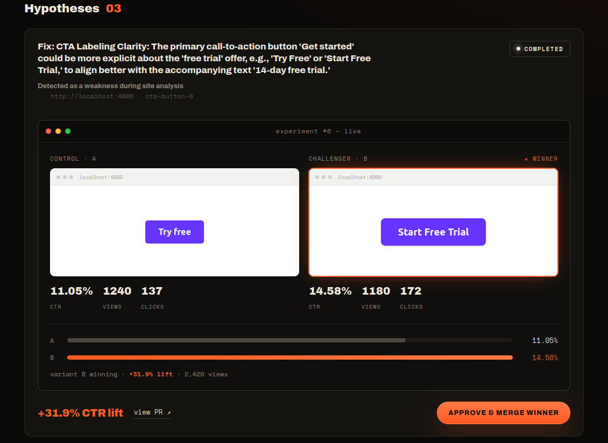
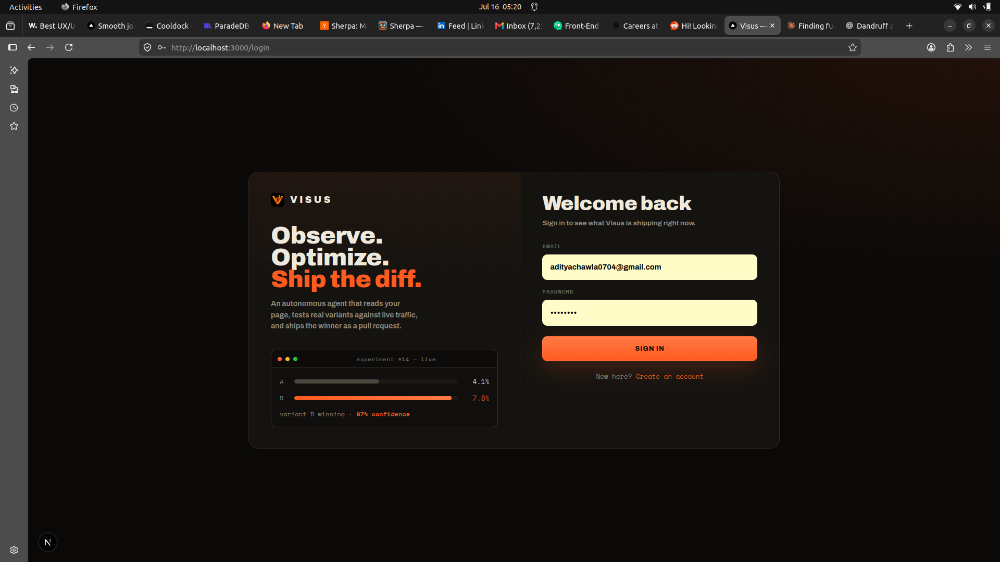

# Visus

Visus is a landing page for an AI tool that helps improve websites.

The idea is simple: Visus looks at how people use a website, finds parts that may be confusing or weak, suggests better versions, tests them, and helps ship the version that performs best.

This repo is currently set up to deploy only the landing page on Vercel. The backend and dashboard are not part of the live deployment.

!

!

---

## What It Does

Visus is built around this flow:

1. A website is connected to Visus.
2. Visus studies the pages and user behavior.
3. It finds areas where users may drop off or miss important actions.
4. It creates ideas for improving the page.
5. It tests different versions.
6. The better version can be sent back as a code change.

In short, Visus is like an AI helper for improving website conversions.

---

## Current Version

The deployed version is a landing page only.

It includes:

- A visual product introduction
- Sections explaining the Visus idea
- 3D and video-based visuals
- A responsive design for desktop and mobile
- A clean static build for Vercel

The live deployment does not include:

- The dashboard
- The experiment detail pages
- The backend server
- Any local database or AI setup

---

## Tech Used

| Part | Technology |
|---|---|
| Website | Next.js, React |
| Styling | Tailwind CSS, custom CSS |
| Visuals | Three.js, React Three Fiber |
| Hosting | Vercel |

---

## Project Structure

```text
Visus/
├── client/                 # The landing page that gets deployed
│   ├── public/             # Logo, video, and 3D files
│   └── src/
│       ├── app/
│       │   ├── page.tsx    # Main landing page
│       │   ├── layout.tsx  # Page layout and metadata
│       │   └── globals.css # Main styling
│       └── components/     # Visual components used by the page
│
└── server/                 # Backend prototype, not deployed right now
```

---

## Run It Locally

```bash
cd client
npm install
npm run dev
```

Then open:

```text
http://localhost:3000
```

---

## Build It

```bash
cd client
npm run build
```

The build should only show:

```text
/
/_not-found
```

That means only the landing page is being deployed.

---

## Deploy on Vercel

Import the GitHub repo into Vercel and use these settings:

| Setting | Value |
|---|---|
| Framework Preset | Next.js |
| Root Directory | `client` |
| Install Command | `npm install` |
| Build Command | `npm run build` |
| Output Directory | Leave default |

Do not choose the `server` folder as the Vercel root.

---

> Visus is an AI tool that helps websites improve themselves. It studies how users behave, finds weak parts of a page, creates better versions, tests them, and helps ship the version that works best.

For the current demo:

> This version is the landing page for the product. It shows the idea, the visual direction, and how the product would work. The backend prototype exists separately, but the live Vercel deployment is focused only on the landing page.
